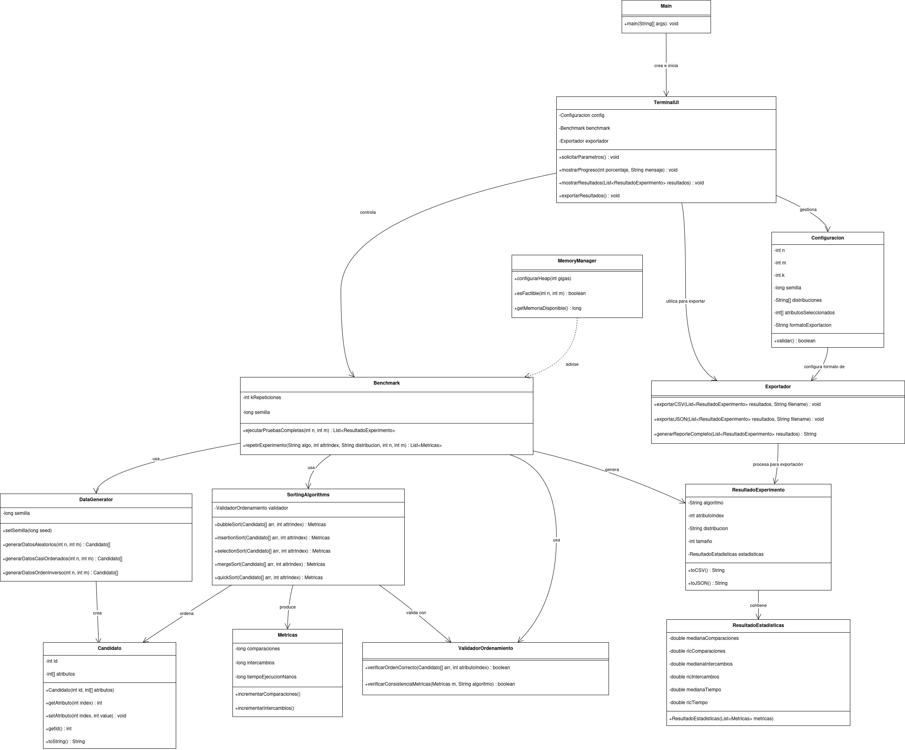

# Algoritmos Ordenamiento (Solución Primer Taller - CIENCIAS DE LA COMPUTACIÓN I)

***

## Integrantes

* Juan Sebastian Vega Diaz - 20231020087
* Nicolás Avendaño Barajas - 20231020113

***

## UML

***

## Informe

[Ver el informe completo (PDF)](docs/InformeTaller1.pdf)

***

## Documentación código

[Ver el informe completo (PDF)](src/Documentacion.pdf)
